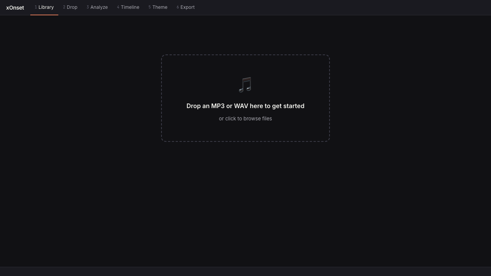
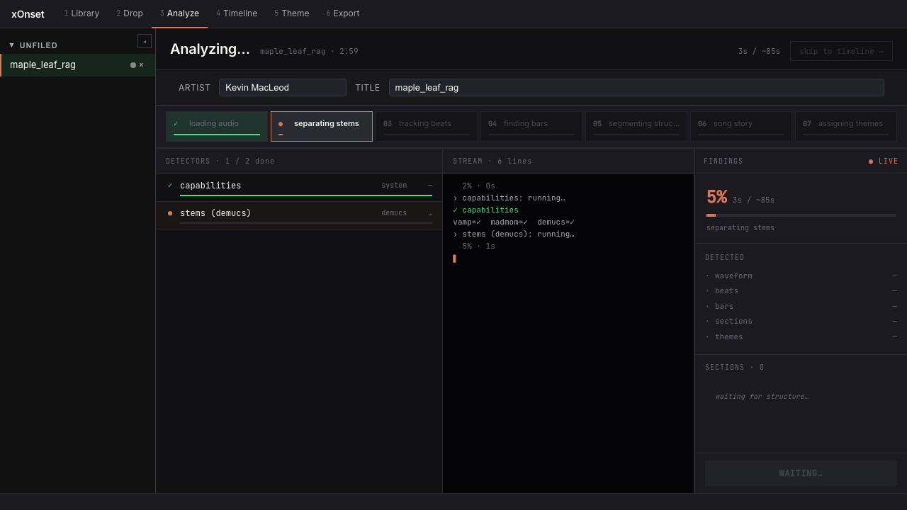
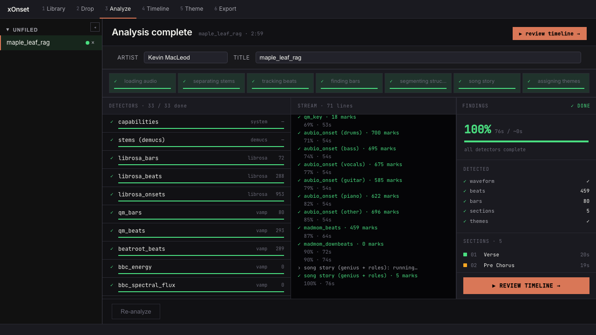
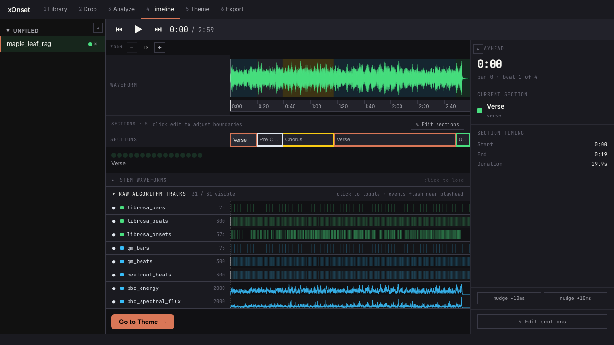
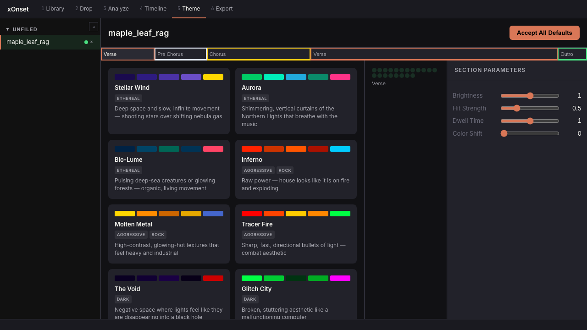
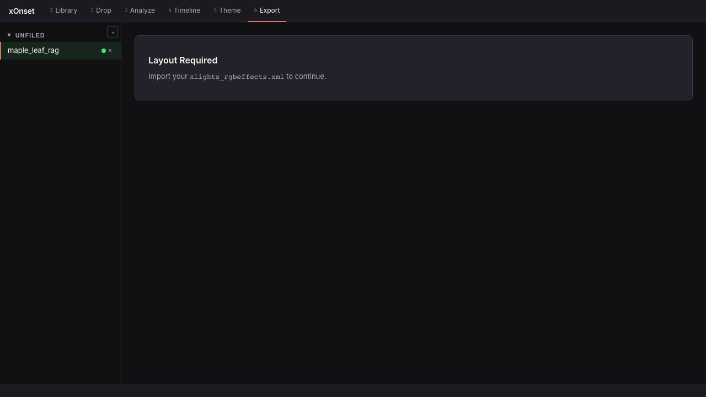
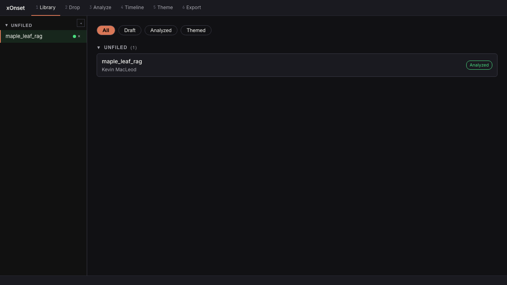

<p align="center">
  
</p>

<h1 align="center">x-onset</h1>
<p align="center"><strong>MP3 to xLights Sequencer</strong></p>
<p align="center">
  Analyzes your music, detects beats/onsets/chords/sections, groups your layout props, and applies themed effects — all driven by the audio.
</p>

---

## What It Does

1. **Audio Analysis** — Analyzes MP3 files using 17 algorithms across 7 hierarchy levels (L0-L6) to extract beats, onsets, chords, sections, energy curves, and stem separation (drums/bass/vocals/guitar/piano/other)
2. **Layout Grouping** — Reads your `xlights_rgbeffects.xml` and auto-generates 8-tier Power Groups (spatial, rhythmic, prop type, compound, heroes)
3. **Effect Library** — 40 xLights effects cataloged with parameters, prop suitability ratings, and analysis-to-parameter mappings
4. **Variant Library** — 212+ pre-tuned effect variants with contextual tags (energy, tier, section role, genre) for quick effect selection
5. **Theme Engine** — 21 composite "looks" (Inferno, Aurora, Winter Wonderland, etc.) organized by mood, occasion, and genre
6. **Song Story** — Automatic section classification with lyric-anchored boundary refinement (syncedlyrics), energy arcs, and lighting moment detection
7. **Sequence Generation** — Produces `.xsq` files ready to import into xLights with effects placed by tier, energy, and theme
8. **Web UI** — Browser-based dashboard for the full workflow: upload, analyze, review, edit themes, browse variants, group layout, and export

---

## Quick Start

Runs anywhere Docker does — Windows, macOS, or Linux. The only
prerequisite is **Docker Desktop** (or Docker Engine on Linux) —
[docker.com](https://www.docker.com/products/docker-desktop/).

```bash
git clone https://github.com/derwin12/xlights-autosequencer.git
cd xlights-autosequencer
docker compose up
```

Open **http://localhost:5000**. First run builds the toolchain image (the
Vamp plugins compile from source — the slow step, easily 20–40 min, but
fully unattended) and installs the Python/JS packages; later runs are
fast. Your song library and cached analysis persist in named Docker
volumes across restarts.

Once the page loads, the first-run flow is: drop an MP3/WAV onto the
**Drop** tab and let the analysis pipeline run. The xLights layout is
fixed — every song exports against the `xlights_rgbeffects.xml` and
`xlights_networks.xml` committed at [`layout/`](layout/), so there's no
per-song layout import step. From there walk the numbered tabs
left-to-right and finish with a Download Package on the Export tab — the
full walkthrough is in [Launch the App](#launch-the-app) and
[The screens](#the-screens) below.

#### Updating

The footer of every screen shows `ui <commit> · built <date> · api <commit>` —
when either commit falls behind `main`, update like this:

```bash
git pull
docker compose exec xonset sh -c "cd src/review/frontend && npm run build"
docker compose restart
```

Then hard-refresh the browser (Ctrl+Shift+R). What each step covers:

- `git pull` — the app code runs from your checkout (bind-mounted into the
  container), so pulling is most of the update.
- The `npm run build` line rebuilds the web UI. Only needed when frontend
  files changed (`src/review/frontend/`), but it's fast and always safe —
  the container skips rebuilding it on startup whenever a built bundle
  already exists, so don't rely on a restart alone to pick up UI changes.
- `docker compose restart` — restarts the Python backend so pulled backend
  changes take effect (it doesn't hot-reload). Expect a couple of quiet
  minutes at `[1/5]` while pip re-checks dependencies.

Only if `.devcontainer/Dockerfile` itself changed (new system-level
dependency — rare) do you need a real rebuild: `docker compose up -d --build`.

#### Your data

Everything you upload or generate (song library, cached stems/analysis,
image library, custom themes) lives under `~/.xlight/` inside the
container, backed by named Docker volumes — it survives restarts,
recreates, and image rebuilds, and isn't tracked in git. To carry it to
another machine, `docker cp` it out of/into the `xlight-state` volume.

> **Contributors:** `.devcontainer/` also works as a VS Code Dev
> Container for interactive development inside the same toolchain image.
> Note it runs an outbound-traffic firewall on start (built for
> sandboxing an AI coding agent) — normal internet access outside its
> allowlist is blocked by design. See `scripts/startapp.sh` for
> restarting the server after backend changes.

---

## Launch the App

`docker compose up` already started the app — open **http://localhost:5000**.
The whole workflow lives in six tabs across the top of every screen:

```
xOnset  1 Library   2 Drop   3 Analyze   4 Timeline   5 Theme   6 Export
```

The numbers indicate the natural order — drop a song in, walk through the tabs left-to-right, finish with an `.xsq` ready for xLights.

---

## The screens

### 1. Library — empty state



Where you start the very first time.

1. **Tab bar** (top). Numbered steps; the active tab is underlined orange. You can revisit any tab at any time.
2. **Drop zone** (centered card). Drag an MP3 / WAV file — or a video file (mp4/mov/avi/mkv/webm), whose audio track is extracted automatically — onto it, or click *"or click to browse files"* to open a native file picker. Both mono and stereo audio are accepted; ID3 metadata is read automatically.

That's the entire screen — the app is deliberately empty here so the call to action is unmissable.

---

### 2. Analyze — pipeline running



After you drop a file, the app jumps straight to **Analyze** and starts the pipeline.

1. **Title bar** — *"Analyzing... `<slug>` · `<duration>`"* on the left, *"`<elapsed>` / ~`<eta>`"* and a **skip to timeline →** escape hatch on the right. The skip button shows up once enough has been detected to render *something* in the timeline.
2. **Artist / Title fields** — read from the MP3's ID3 tags. Edit either to override what's used for the synced-lyrics lookup.
3. **Phase pills** — seven logical phases (loading audio → separating stems → tracking beats → finding bars → segmenting structure → song story → assigning themes). The active phase is outlined; completed phases get a green checkmark.
4. **Detectors column** (left) — every algorithm the pipeline will run, in execution order. Each row shows status (queued / running / done), library tag (system, demucs, librosa, vamp, madmom), and progress.
5. **Stream column** (middle) — live SSE log lines from the pipeline. Mostly the same information as the Detectors column but in narrative form, with elapsed time per detector.
6. **Findings column** (right) — overall progress %, ETA, list of high-level outputs (waveform, beats, bars, sections, themes), and a live-growing **Sections** list as the structure detector finds boundaries.
7. **Song rail** (far left, collapsible). Songs you've imported, grouped by folder. Switch between songs by clicking; the right side switches to whichever song you pick.

---

### 3. Analyze — complete



Same screen, after the pipeline finishes (~60–90 s on a typical song with cached stems).

1. **Title bar** flips to *"Analysis complete"* with a prominent **▶ review timeline →** button on the right.
2. **All seven phases** show green checkmarks.
3. **Detectors** — full list (33 / 33 done), each with its detected mark count visible (e.g. `librosa_beats · 288`, `aubio_onset (drums) · 700 marks`).
4. **Stream** — the full progress log, scrollable.
5. **Findings** — 100 %, with per-category counts (`waveform ✓`, `beats 459`, `bars 80`, `sections 5`, `themes ✓`) and the actual section list with role + duration (`01 Verse · 20s`, `02 Pre Chorus · 19s`, ...).
6. **Re-analyze** button (bottom left) — re-runs the pipeline from scratch, ignoring any cache. Useful after a story-builder schema bump, or when you've edited the artist/title fields and want a fresh synced-lyrics lookup.

---

### 4. Timeline — review and adjust



The most-used screen. Verifies the analysis matched what you hear.

1. **Transport** (top center) — ⏮ ▶ ⏭ play/scrub controls, current position / total duration.
2. **Zoom controls** — `−` / `+` buttons; reads as `1×`, `2×`, etc. Higher zoom narrows the visible window so you can scrub onto a single beat.
3. **Waveform** — full-mix audio rendered as a green stereo waveform, with a 0:00–total-duration time ruler underneath. Click anywhere on it to seek the playhead.
4. **Sections row** — colored boxes per detected section, labeled by role (Verse, Pre Chorus, Chorus, Bridge, Outro, Interlude, etc.). Click *"Edit sections"* (button on the right) to adjust boundaries by dragging.
5. **Section beat counter** — small dots showing the bar/beat structure within the currently-visible window.
6. **Stem waveforms** (collapsible) — drums / bass / vocals / guitar / piano / other waveforms stacked. Click *"click to load"* to render them; useful for verifying the stem separation looks right.
7. **Raw algorithm tracks** — every individual detector's output as a flash-when-the-event-passes tick row. Each row shows the algorithm name, the event count, and a sparkline. Toggle visibility per-row to declutter; the *"31 / 31 visible"* counter updates.
8. **AYHEAD inspector** (right column) — current playback position formatted as `bar X · beat Y of Z`.
9. **Current section** — name and color of whatever section the playhead is in right now. Updates as you scrub.
10. **Section timing** — start / end / duration of the current section.
11. **Nudge buttons** — `−10 ms` / `+10 ms` to micro-adjust the active section's start time. Hold-and-drag for repeated nudges.
12. **Go to Theme →** (bottom) — finishes timeline review and moves to the next step.

---

### 5. Theme — assign a look per section



Pick a *theme* (composite lighting "look") for each section of the song. Themes encode color palette, effect choice, blend modes, and parameter mappings.

1. **Section navigator** (top) — every detected section as a clickable pill (Verse / Pre Chorus / Chorus / Verse / Outro). The active pill outlines orange; click to switch which section you're theming.
2. **Accept All Defaults** (top right) — auto-assigns theme defaults to every section using the song's energy/genre profile. Good starting point if you don't want to pick one-by-one.
3. **Theme grid** (center) — each card is one theme:
   - **Palette swatch** strip (5 colors) at the top.
   - **Theme name** (e.g. *Aurora*, *Inferno*, *Stellar Wind*).
   - **Mood tags** (e.g. ETHEREAL, AGGRESSIVE, ROCK, DARK) for quick filtering.
   - **One-line description** — what the theme evokes.
   Click a card to assign it to the active section.
4. **Section beat strip** (right of the grid) — visualizes the currently-selected section's beat structure, labeled with the section name.
5. **Section parameters** (right column) — four sliders that fine-tune *this section's* render of the chosen theme:
   - **Brightness** — global intensity (0 – 1)
   - **Hit Strength** — accent emphasis on beats (0 – 1)
   - **Dwell Time** — how long held effects last (0 – 1)
   - **Color Shift** — palette rotation (0 – 1)

Per-section overrides are remembered when you switch sections; the **Accept All Defaults** button resets them.

---

### 6. Export — produce the .xsq



The terminal step. Generates the xLights `.xsq` sequence from the analyzed song + assigned themes + the repo's committed prop layout.

- **Generate button** — produces the `.xsq`.
- **Layout summary** — number of models / groups / props detected from `layout/xlights_rgbeffects.xml`, and which 8-tier Power Groups were auto-generated (heroes, compounds, props, beats, etc.).
- **Generation options** — variation seed, repetition policy, palette restraint, duration scaling. Most users leave defaults.
- **Download Package** — bundles the generated `.xsq` with `layout/xlights_rgbeffects.xml` and `layout/xlights_networks.xml` into a single `.xsqz` (xLights' own zipped-sequence-package extension) ready to import directly into xLights.

---

### 7. Library — populated state



Where you go to switch between songs once you've imported a few.

1. **Filter pills** (top) — *All / Draft / Analyzed / Themed*. Filters the song list by status. *Draft* = imported but not analyzed; *Analyzed* = pipeline complete; *Themed* = at least one section has a theme assignment.
2. **Folder groups** — songs are bucketed by `folder_id` (default `unfiled`). The count next to each folder name shows how many songs are in it. Click the chevron to collapse / expand.
3. **Song row** — each row shows title, artist (from ID3 or override), and a **status badge** (`Analyzed`, `Themed`, `Draft`). Click anywhere on the row to open it in whatever tab you visit next.
4. **Song rail** (far left) — a permanent compact list across every screen, so you can switch between songs without leaving the current step.

---

## Output Files

The UI workflow writes these next to the source MP3:

```
song.mp3
song/
├── song_hierarchy.json         # Analyzer output (L0–L6 hierarchy)
├── song_story.json             # Story builder output (sections, roles, moments)
└── song.xsq                    # Sequence to import into xLights
.stems/<md5>/                   # Cached Demucs stem separation (drums, bass, vocals, guitar, piano, other)
```

`_hierarchy.json` and `_story.json` are caches — re-running the pipeline reads them when nothing relevant has changed. `.xsq` is the deliverable.

### Importing into xLights

In xLights: **File → Open Sequence**, point at `song.xsq`. The .xsq is self-contained; xLights will resolve effects and timing from the file.

---

## Project Structure

```
src/
├── analyzer/               # Audio analysis pipeline
│   ├── audio.py            # MP3 loading via librosa
│   ├── result.py           # Data classes (TimingTrack, HierarchyResult, etc.)
│   ├── runner.py           # Orchestrates algorithm runs
│   ├── orchestrator.py     # Hierarchy assembly (L0-L6)
│   ├── scorer.py           # Quality scoring
│   ├── stems.py            # Demucs stem separation (6 stems)
│   ├── phonemes.py         # WhisperX phoneme analysis
│   ├── xtiming.py          # .xtiming XML writer
│   ├── xvc_export.py       # .xvc value curve writer
│   ├── pipeline.py         # End-to-end export pipeline
│   └── algorithms/         # 17 algorithm implementations (librosa, vamp, madmom, essentia)
├── grouper/                # xLights layout -> Power Groups
│   ├── layout.py           # Parse xlights_rgbeffects.xml
│   ├── classifier.py       # Normalize, classify, detect heroes
│   ├── grouper.py          # 8-tier group generation
│   └── writer.py           # Inject groups back into XML
├── effects/                # xLights effect catalog
│   ├── builtin_effects.json  # 35 effect definitions
│   ├── models.py           # EffectDefinition, EffectParameter, AnalysisMapping
│   └── library.py          # Load, query effects
├── variants/               # Pre-tuned effect presets
│   ├── builtins/           # 34 per-effect JSON files (123+ variants)
│   ├── models.py           # EffectVariant, VariantTags
│   ├── library.py          # Load, query, save custom variants
│   ├── scorer.py           # Context-aware variant scoring
│   └── importer.py         # Import variants from .xsq files
├── themes/                 # Composite effect themes
│   ├── builtin_themes.json # 21 theme definitions
│   ├── models.py           # Theme, EffectLayer (with variant_ref)
│   └── library.py          # Load, query by mood/occasion/genre
├── story/                  # Song story builder
│   ├── models.py           # SongStory, Section, Moment, MoodCurve
│   ├── builder.py          # Build story from hierarchy + lyric-anchored refinement
│   ├── section_classifier.py # Detect verse/chorus/bridge/etc.
│   ├── energy_arc.py       # Energy curve computation
│   └── lighting_mapper.py  # Map story to lighting cues
├── generator/              # Sequence generation
│   ├── models.py           # GeneratorConfig, SequencePlan, EffectPlacement
│   ├── plan.py             # Generate effect placement plan
│   ├── theme_selector.py   # Theme selection by mood/occasion
│   ├── effect_placer.py    # Place effects on props (resolves variant_ref)
│   ├── value_curves.py     # Dynamic parameter changes
│   └── xsq_writer.py      # Write .xsq sequence XML
├── review/                 # Web UI
│   ├── server.py           # Flask app (dashboard, upload, timeline, export)
│   ├── theme_routes.py     # Theme CRUD API + editor page
│   ├── variant_routes.py   # Variant library API + browser page
│   ├── story_routes.py     # Story review API
│   └── static/             # HTML, CSS, JS (vanilla, no build step)
├── cli.py                  # Click CLI entry point (30+ commands)
├── cache.py                # MD5-keyed analysis cache
├── library.py              # ~/.xlight/library.json song index
└── export.py               # JSON serialization
```

---

## User Data

| Path | Contents |
|------|----------|
| `~/.xlight/library.json` | Song library index |
| `~/.xlight/custom_themes/*.json` | Custom theme overrides |
| `~/.xlight/custom_variants/*.json` | Custom effect variants |
| `~/.xlight/sweep_configs/` | Parameter sweep configs |
| `.stems/<md5>/` | Cached stem separation output (adjacent to source audio) |

---

## Known Issues

| Issue | Fix |
|-------|-----|
| `TorchCodec is required` warning | Harmless — can be ignored |
| Stem separation slow on first run | Normal — demucs downloads ~200 MB model. Cached after first run. |
| whisperx alignment model fails | `docker compose exec xonset sh -c "pip install huggingface_hub && huggingface-cli login"` |

---

## Running Tests

```bash
docker compose exec xonset pytest tests/ -v
```

---

## Documentation

Detailed docs for each subsystem are in [`docs/`](docs/README.md).

## License

This project is licensed under the MIT License — see [LICENSE](LICENSE) for details.
